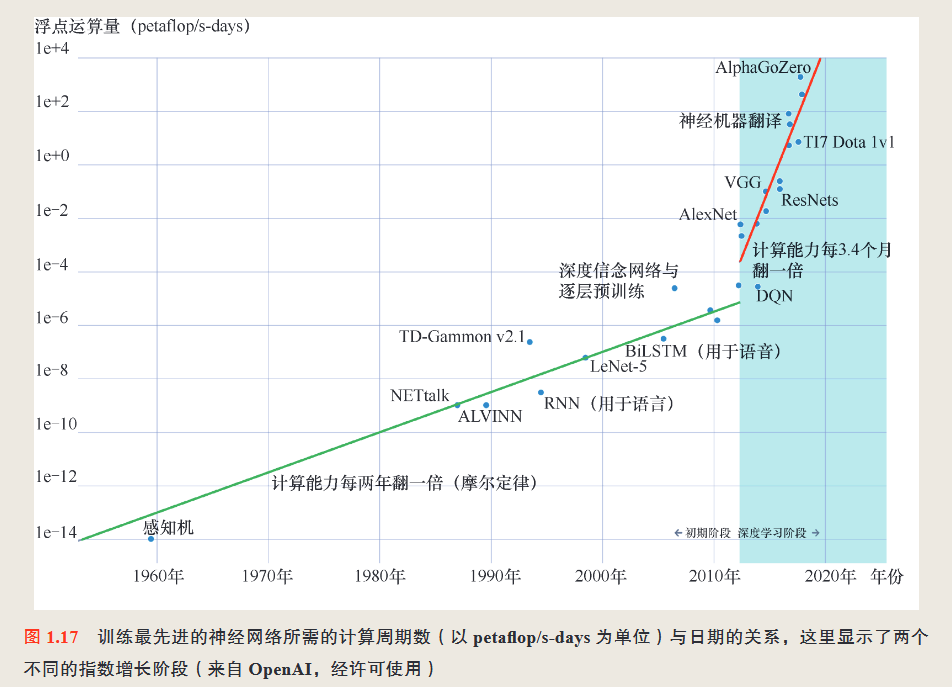
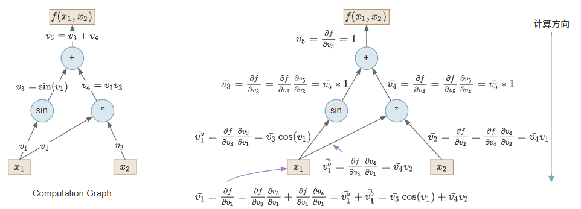

# 📘 深度学习读书笔记 | Deep Learning: Foundations and Concepts

## 📖 章节信息

*   **书名**：Deep Learning: Foundations and Concepts
*   **章节**：第 1 章 - 《深度学习革命》
*   **阅读日期**：2025/06/16
*   **阅读页码**：1–19（书本页码）

***

## 🧠 核心概念总结 | Core Concepts Summary

1.  深度学习的“革命”源于大数据、计算能力、算法三者的交汇。

2.  与传统机器学习相比，深度学习强调端到端的特征学习，不依赖人工特征提取。

3.  神经网络虽早已有之，但由于深度网络的训练困难，一度沉寂，直到新技术（规模化,残差连接(residual connection),自 动 微 分(automatic differentiation)）才真正引发复兴。

***

## 🧪 关键公式与推导 | Key Equations & Derivations

本章以概念性介绍为主，无具体数学推导，强调历史背景与应用场景。

***

## 💡 关键图示解读 | Diagram Interpretation

*   **图名或编号1.17**：
  

*   **解读**：

    *  “从 感知机时代直至 2012 年前后,计算需求的翻倍周期约为 2 年,这与摩尔定律所预测的 计算性能增长的总体趋势基本吻合。然而,自 2012 年步入深度学习时代以来,计算需 求再次呈现出指数级的增长态势,但这一次的翻倍周期锐减至仅3.4 个月,这意味着 计算能力每年增长高达 10 倍之多!” 
***

## 🔍 难点与疑问 | Difficult Points & Questions

1.  如何评估“可解释性”与“准确率”的权衡？

***

## 📎 与现实应用的联系 | Connection to Real-World Applications

*   可用于医疗图像识别、人脸识别、NLP等任务；

***

## 🛠️ 实验/代码实践记录 | Code or Experiment Reflection

本章为概述性章节，暂未涉及具体实验内容。

***

## 🧭 知识图谱更新 | Update to Knowledge Graph

*   “深度学习历史”节点新增：

    *   感知机 ➝ BP ➝ 深层网络 ➝ GPU ➝ ImageNet ➝ Transformer

*   “神经网络优势”节点新增：

    *   特征自动提取、表达能力强、可微优化路径

*   “技术细节”节点新增：

    *  残差连接(residual connection)
    *  残差连接是深度神经网络中的一种结构设计，最早用于 ResNet（Residual Network） 网络中。它的核心思想是：让神经网络学习残差（residual），而不是直接学习目标映射。
    *  自 动 微 分(automatic differentiation)方法

***

## 📚 延伸阅读 & 参考资料 | Further Reading

*   残差连接：https\://medium.com/data-science/what-is-residual-connection-efb07cab0d55
*   论文：《Deep Residual Learning for Image Recognition》 (ResNets)

<!---->

*   自 动 微 分：<https://lotabout.me/2023/Auto-Differentiation-Part-1-Algorithm/>

*   论文：《Automatic differentiation in machine learning: a survey》

***

## 📌 To-Do 列表 | Tasks to Follow Up

1.  阅读Resnet 论文和源代码
2.  阅读自动微分的相关论文
3.  了解深度学习规模化的底层原理，包括CUDA
4.  了解深度学习规模化的各种技巧，比如DDP等等
